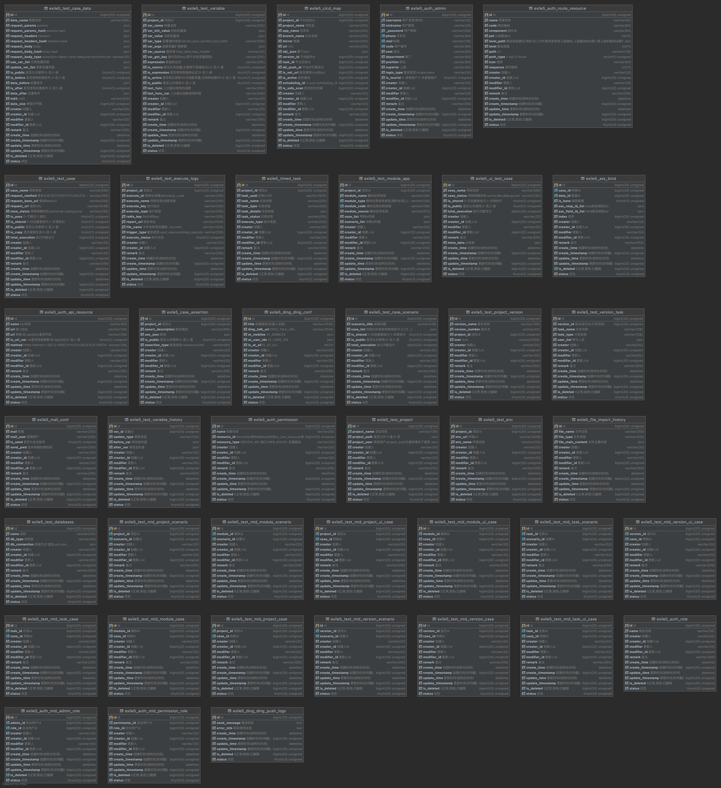

# ExileTestPlatformServer

# 放逐测试平台

### 前言

作者是前豌豆思维测试小弟，豌豆测试平台V1.0与V2.0的创造者，单人充当产品，设计，开发，测试，运维，内部运营推广等6个角色，旧测试平台就不在这里展示了。

因各种因素导致最后测试平台落地的结果并不理想，但在整个过程中受益匪浅并有所总结，而我还是想做出一个能让大部测试人员都认可并真正能降本增效的测试平台，从而有了这个放逐测试平台，既然不能服务于一个公司那么就流放到整个测试社区，让更多的测试人员对此平台进行检验，因此取名放逐。

后续我会以组织的形式重构它，使它能够商业定制化，如果你感兴趣，(最下方)请联系我。

respect ! ! !

### 历程

- 2020-7-18：豌豆测试平台V1.0（豌豆思维）
- 2020-9-18：豌豆测试平台V2.0（豌豆思维，豌豆测试平台V1.0重构）
- 2021-7-20：放逐测试平台V3.0（个人开源，因开发如下V4.0期间没有抽离代码，暂时关闭仓库，将在如下V5.0重新开启）
- 2022-2-23：某某测试平台V4.0（某上市公司，基于上述的个人开源放逐测试平台V3.0扩展定制化开发）
- 2022-9-10：放逐测试平台V5.0（个人开源，基于放逐测试平台V3.0重构）

### 项目文档

- 文档地址-GitHub：https://github.com/yangyuexiong/ExileTestPlatformServer
- 文档地址-码云：https://gitee.com/yangyuexiong/ExileTestPlatformServer

### 项目介绍

`ExileTestPlatform`项目目前主要基于测试人员对测试用例配置环境，参数，变量，响应断言规则，数据库断言规则后，实施测试的接口测试平台(后续兼容UI测试)。

### 项目演示

- 项目演示地址(admin，123456)：
  
    推荐：http://106.75.174.40
  
    调试：http://120.24.214.173
  
    调试：http://test.metatuple.com

  
- 操作文档(Github)：https://github.com/yangyuexiong/ExileTestPlatformServer/blob/main/DOC.md
- 操作文档(Gitee)：https://gitee.com/yangyuexiong/ExileTestPlatformServer/blob/main/DOC.md
- 前端项目地址-GitHub：https://github.com/yangyuexiong/ExileTestPlatformWeb
- 前端项目地址-码云：https://gitee.com/yangyuexiong/ExileTestPlatformWeb

### 系统架构图

- 无法查看图片可以前往码云：https://gitee.com/yangyuexiong/ExileTestPlatformServer

### 业务流程图

### 领域模型图

### 数据库表设计

- [SQL文件：ExileTestPlatform.sql](./docs/SQL/ExileTestPlatform.sql)

- 数据库表设计总览
  

- 核心业务数据库表设计
  
  

### UML类图

### 后端技术

- 当前使用的是Python相关技术栈，后续新增golang，java等语言相关技术栈实现相同的功能，尽可以满足不同语言的开发人员进行二次开发

|技术|说明|官网|
|----------------------------------------|-------------------|---------------------------------------------- |
|Flask2.0|同步非阻塞MVC框架(2.0.2版本加入async异步)|https://flask.palletsprojects.com|
|Flask_BestPractices|Flask最佳实践(该项目使用的项目结构)|https://github.com/yangyuexiong/Flask_BestPractices|
|Flask-SQLAlchemy|ORM|http://www.pythondoc.com/flask-sqlalchemy/quickstart.html|
|Flask-Migrate|Alembic处理Flask应用程序的SQLAlchemy数据库迁移|https://flask-migrate.readthedocs.io/en/latest|
|Flask-CORS|用于处理跨源资源共享(CORS)的Flask扩展，使跨源AJAX|https://pypi.org/project/Flask-Cors|
|PyMySQL|纯Python MySQL客户端库。PyMySQL的目标是成为MySQLdb的替代品，并在CPython、PyPy、IronPython和Jython上工作|https://pypi.org/project/PyMySQL/0.6.1|
|DBUtils|数据库连接池|https://pypi.org/project/DBUtils|
|Requests|Python HTTP库|https://docs.python-requests.org/en/latest/user/install|
|loguru|美化Python日志记录|https://pypi.org/project/loguru|
|Redis|缓存|https://redis.io|
|MySQl|关系型数据库|https://www.mysql.com|
|Celery5.2+|异步任务|https://docs.celeryq.dev/en/stable|
|Flask-APScheduler|定时任务|https://viniciuschiele.github.io/flask-apscheduler|

### 前端技术

|技术|说明|官网|
|----------|--------------------- | -------------------------------------- |
|Vue3|前端框架|https://vuejs.org|
|Vue-router|路由框架|https://router.vuejs.org|
|Vuex|全局状态管理框架|https://vuex.vuejs.org|
|ElementPlus|前端UI框架|https://element.eleme.io|
|Axios|前端HTTP框架|https://github.com/axios/axios|
|v-charts|基于Echarts的图表框架|https://v-charts.js.org|
|Js-cookie|cookie管理工具|https://github.com/js-cookie/js-cookie|
|nprogress|进度条控件|https://github.com/rstacruz/nprogress|

### 项目结构

- 参考我的-Flask最佳实践-GitHub：https://github.com/yangyuexiong/Flask_BestPractices
- 参考我的-Flask最佳实践-码云：https://gitee.com/yangyuexiong/Flask_BestPractices

### 接口清单

- [Postman文件](docs/接口文档/ExileTestPlatform.postman_collection.json)

|ID|接口名称|请求方式|功能描述|备注|
|---|--------------------|-----------|--------|--------|
|1|/api|GET|index|
|2|/api|POST|首页仪表盘|
|3|/api/tourist|GET|获取游客账号|
|4|/api/user_profile/{id}|GET|个人信息|
|5|/api/user_profile|PUT|更新个人信息|
|6|/api/user_pwd|POST|修改密码|
|7|/api/user_pwd|PUT|重置密码|
|8|/api/login|POST|登录|
|9|/api/login|DELETE|退出|
|10|/api/case_env/{id}|GET|测试环境详情|
|11|/api/case_env|POST|新增测试环境|
|12|/api/case_env|PUT|编辑测试环境|
|13|/api/case_env|DELETE|删除测试环境|
|14|/api/case/{id}|GET|用例详情|
|15|/api/case|POST|新增用例|
|16|/api/case|PUT|编辑用例 |
|17|/api/case|DELETE|删除用例|
|18|/api/case_copy|POST|用例复制|
|19|/api/case_set|POST|用户用例收藏(标记)|
|20|/api/case_scenario/{id}|GET|场景详情|
|21|/api/case_scenario|POST|新增场景例|
|22|/api/case_scenario|PUT|编辑场景|
|23|/api/case_scenario|DELETE|删除场景|
|24|/api/case_req_data/{id}|GET|获取用例Req数据|
|25|/api/case_req_data|POST|新增用例Req数据|
|26|/api/case_req_data|PUT|编辑用例Req数据|
|27|/api/case_req_data|DELETE|删除用例Req数据|
|28|/api/case_var/{id}|GET|变量详情|
|29|/api/case_var|POST|新增变量|
|30|/api/case_var|PUT|编辑变量|
|31|/api/case_var|DELETE|删除变量|
|32|/api/case_db/{id}|GET|用例数据库详情|
|33|/api/case_db|POST|新增用例数据|
|34|/api/case_db|PUT|编辑用例数据|
|35|/api/case_db|DELETE|删除用例数据|
|36|/api/resp_ass_rule/{id}|GET|获取请求响应断言规则明细|
|37|/api/resp_ass_rule|POST|新增请求响应断言规则明细|
|38|/api/resp_ass_rule|PUT|编辑请求响应断言规则明细|
|39|/api/resp_ass_rule|DELETE|删除请求响应断言规则明细|
|40|/api/field_ass_rule/{id}|GET|获取数据库字段断言规则明细|
|41|/api/field_ass_rule|POST|新增数据库字段断言规则明细|
|42|/api/field_ass_rule|PUT|编辑数据库字段断言规则明细|
|43|/api/field_ass_rule|DELETE|删除数据库字段断言规则明细|
|44|/api/case_bind|POST|用例绑定参数与断言和关系变量(创建用例时调用)|
|45|/api/case_bind|PUT|用例绑定参数与断言和关系变量(编辑用例时调用)|
|46|/api/case_bind_data|POST|用例req参数绑定(停用)|
|47|/api/case_bind_data|PUT|用例req参数解绑(停用)|
|48|/api/case_bind_resp_ass|POST|请求响应断言规则绑定(停用)|
|49|/api/case_bind_field_ass|POST|数据库字段断言规则绑定(停用)|
|50|/api/case_page|POST|用例分页模糊查询|
|51|/api/case_var_page|POST|用例变量分页模糊查询|
|52|/api/case_var_history|POST|用例变量更新历史列表查询|
|53|/api/resp_ass_rule_page|POST|返回值断言规则分页模糊查询|
|54|/api/field_ass_rule_page|POST|字段断言规则分页模糊查询|
|55|/api/case_req_data_page|POST|用例请求参数分页模糊查询|
|56|/api/case_env_page|POST|测试环境分页模糊查询|
|57|/api/case_db_page|POST|用例测试数据库分页模糊查询|
|58|/api/case_scenario_page|POST|用例场景分页模糊查询|
|59|/api/case_logs_page|POST|操作日志分页模糊查询|
|60|/api/case_execute_logs_page|POST|执行日志分页模糊查询|
|61|/api/user_page|POST|用户分页模糊查询|
|62|/api/case_send|POST|调试请求|像Postman一样
|63|/api/case_exec|POST|用例执行|根据参数控制
|64|/api/case_exec|POST|场景执行|根据参数控制
|65|/api/case_execute_logs|POST|用例/场景最新执行日志|
|66|/api/rule_test|POST|取值规则调试|
|67|/api/case_report|POST|生成测试报告|
|68|/api/mail_conf|POST|新增邮箱|
|69|/api/mail_conf|PUT|编辑邮箱|
|70|/api/mail_conf|DELETE|删除邮箱|
|71|/api/mail_conf_page|POST|邮箱分页模糊查询|
|72|/api/dd_conf|POST|新增钉钉配置|
|73|/api/dd_conf|PUT|编辑钉钉配置|
|74|/api/dd_conf|DELETE|删除钉钉配置|
|75|/api/dd_conf_page|POST|钉钉配置分页模糊查询|
|76|/api/platform_conf|GET|平台配置加载|
|77|/api/case_db_ping/{db_id}|GET|db ping|
|78|/api/platform_conf|POST|平台配置|
|79|/api/project/{project_id}|GET|项目详情|
|80|/api/project|POST|新增项目|
|81|/api/project|PUT|编辑项目|
|82|/api/project|DELETE|删除项目|
|82|/api/project_page|POST|项目分页查询|
|83|/api/project_version/{version_id}|GET|版本迭代详情|
|84|/api/project_version|POST|新增版本迭代|
|85|/api/project_version|PUT|编辑版本迭代|
|86|/api/project_version|DELETE|删除版本迭代|
|86|/api/project_version_page|POST|版本迭代分页查询|
|87|/api/version_task/{task_id}|GET|任务详情|
|88|/api/version_task|POST|新增任务|
|89|/api/version_task|PUT|编辑任务|
|90|/api/version_task|DELETE|删除任务|
|91|/api/version_task_page|POST|任务分页查询|
|92|/api/module_app/{module_id}|GET|模块详情|
|93|/api/module_app|POST|新增模块|
|94|/api/module_app|PUT|编辑模块|
|95|/api/module_app|DELETE|删除模块|
|96|/api/module_app_page|POST|模块分页查询|
|97|/api/timed_task/{timed_task_uuid}|GET|获取定时任务状态|
|98|/api/timed_task|POST|新增定时任务|
|99|/api/timed_task|PUT|编辑定时任务|
|100|/api/timed_task_status|POST|启动定时任务|
|101|/api/timed_task_status|PUt|暂停定时任务|
|102|/api/timed_task_status|DELETE|删除定时任务|
|103|/api/timed_task_page|POST|定时任务分页查询|

### 项目部署

- 前端：待补充
- 后端：
    - 方法1：本机部署：https://juejin.cn/post/6844903870250876935
    - 方法2：Docker部署：https://juejin.cn/post/7054460759526342687
    - 方法3：执行该项目下的 `server_start.sh` (推荐)

### 备注

- 文档可能存在不清晰的地方，有问题可以添加 `QQ or Wechat：417993207` 