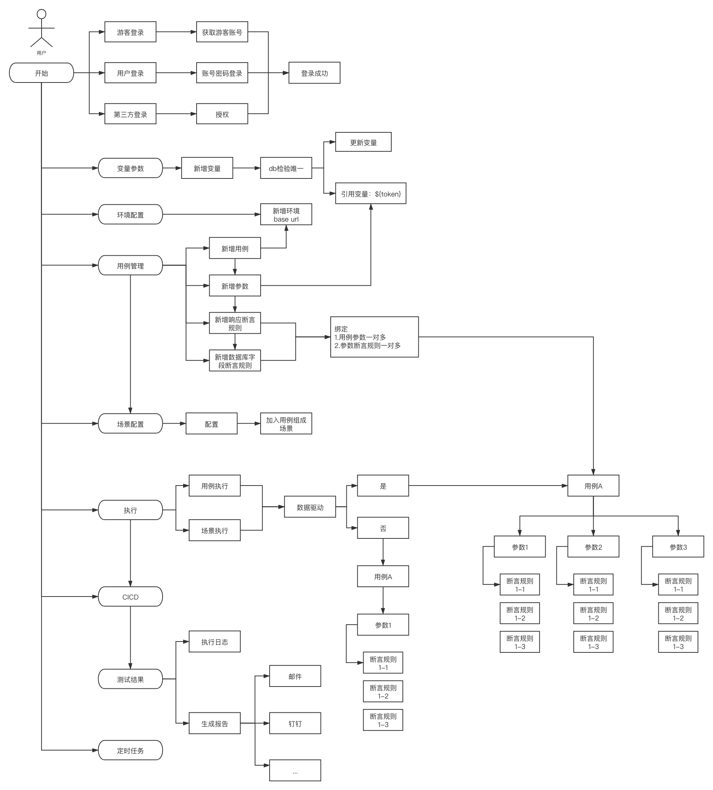

# ExileTestPlatformServer(in development...)
# 放逐测试平台(开发中...)

##### 系统架构图

##### 业务流程图

##### 接口清单

|ID| 接口名称              | 请求方式   | 功能描述    |备注|
|---|--------------------|-----------|--------|--------
|1|/api|GET|index|
|2|/api/tourist|GET|获取游客账号|
|3|/api/login|POST|登录|
|4|/api/login|DELETE|退出|
|5|/api/case_env/{id}|GET|测试环境详情  |
|6|/api/case_env|POST|新增测试环境  |
|7|/api/case_env|PUT|编辑测试环境  |
|8|/api/case_env|DELETE|删除测试环境  |
|9|/api/case/{id}|GET|用例详情  |
|10|/api/case|POST|新增用例|
|11|/api/case|PUT|编辑用例 |
|12|/api/case|DELETE|删除用例  |
|13|/api/case_scenario/{id}|GET|场景详情|
|14|/api/case_scenario|POST|新增场景例|
|15|/api/case_scenario|PUT|编辑场景|
|16|/api/case_scenario|DELETE|删除场景|
|17|/api/case_req_data/{id}|GET|获取用例Req数据|
|18|/api/case_req_data|POST|新增用例Req数据|
|19|/api/case_req_data|PUT|编辑用例Req数据|
|20|/api/case_req_data|DELETE|删除用例Req数据|
|21|/api/case_var/{id}|GET|变量详情|
|22|/api/case_var|POST|新增变量|
|23|/api/case_var|PUT|编辑变量|
|24|/api/case_var|DELETE|删除变量|
|25|/api/case_db/{id}|GET|用例数据库详情|
|26|/api/case_db|POST|新增用例数据|
|27|/api/case_db|PUT|编辑用例数据|
|28|/api/case_db|DELETE|删除用例数据|
|29|/api/resp_ass_rule/{id}|GET|获取请求响应断言规则明细|
|30|/api/resp_ass_rule|POST|新增请求响应断言规则明细|
|31|/api/resp_ass_rule|PUT|编辑请求响应断言规则明细|
|32|/api/resp_ass_rule|DELETE|删除请求响应断言规则明细|
|33|/api/field_ass_rule/{id}|GET|获取数据库字段断言规则明细|
|34|/api/field_ass_rule|POST|新增数据库字段断言规则明细|
|35|/api/field_ass_rule|PUT|编辑数据库字段断言规则明细|
|36|/api/field_ass_rule|DELETE|删除数据库字段断言规则明细|
|37|/api/case_bind_data|POST|用例绑定请求参数|
|38|/api/case_bind_data|PUT|用例解除绑定请求参数|
|39|/api/case_bind_resp_ass|POST|请求响应断言规则绑定|
|40|/api/case_bind_field_ass|POST|数据库字段断言规则绑定|
|41|/api/case_exec|POST|用例执行|根据参数控制
|42|/api/case_exec|POST|场景执行|根据参数控制
|43|/api/rule_test|POST|取值规则调试|
|44|/api/case_page|POST|用例分页模糊查询|
|45|/api/case_var_page|POST|用例变量分页模糊查询|
|46|/api/resp_ass_rule_page|POST|返回值断言规则分页模糊查询|
|47|/api/field_ass_rule_page|POST|字段断言规则分页模糊查询|
|48|/api/case_req_data_page|POST|用例请求参数分页模糊查询|
|49|/api/case_env_page|POST|测试环境分页模糊查询|
|50|/api/case_db_page|POST|用例测试数据库分页模糊查询|
|51|/api/case_scenario_page|POST|用例场景分页模糊查询|