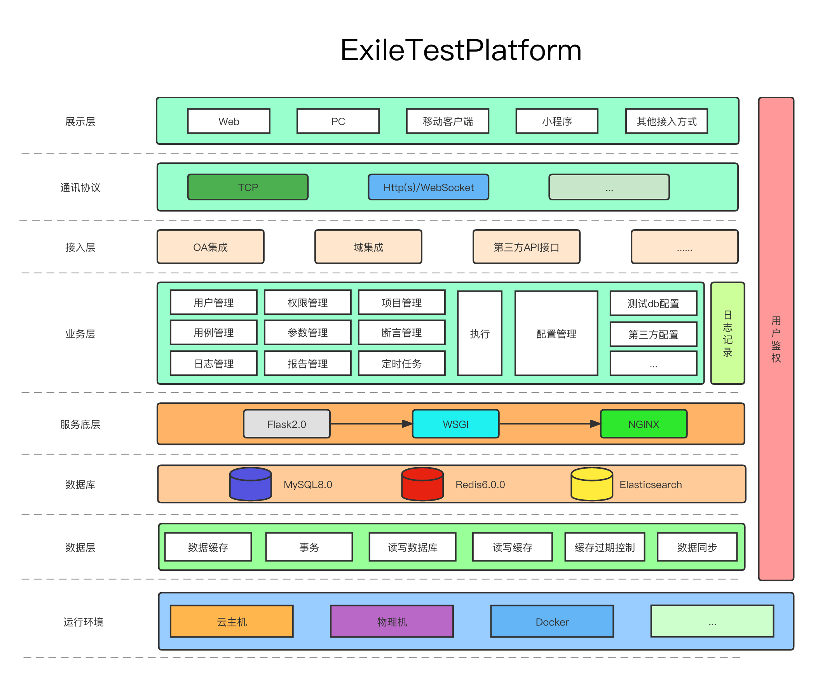

# ExileTestPlatformServer

## 放逐测试平台

### 前言

主作者 [YangYueXiong](https://github.com/yangyuexiong) 是某测试平台V1.0与V2.0的设计者，期间充当产品，设计，研发，测试，运维，内部推广等多个角色。

据了解因各种因素导致最后测试平台落地的结果并不理想，但在整个过程中其受益匪浅并有所总结，而组织者 [ExileLine](https://github.com/ExileLine)
还是想做出一个能让大部测试人员都认可并真正能降本增效的测试平台，从而有了这个放逐测试平台，其言既然不能于公司中很好的实践，那么就流放到整个测试社区，让更多的测试人员使用并提出建议使其更好的发挥实际作用，因此取名放逐。

组织者 [ExileLine](https://github.com/ExileLine) 希望后续能以组织的形式重构它，使它能够商业定制化，如果你感兴趣，点亮Star，(最下方)请联系我们。

Respect ! ! !

### 历程

- 2020-7-18：某某测试平台V1.0（某思维）
- 2020-9-18：某某测试平台V2.0（某思维，某某测试平台V1.0重构）
- 2021-7-20：放逐测试平台V3.0（个人开源，因开发如下V4.0，仓库关闭）
- 2022-2-23：某某测试平台V4.0（基于上述的个人开源放逐测试平台V3.0扩展定制化开发）
- 2023-6-18：放逐测试平台V5.0（组织开源）

### 项目介绍

`ExileTestPlatform`项目主要基于测试人员对测试用例配置环境，参数，变量，响应断言规则，数据库断言规则后，生成一套具备数据驱动的测试规则，实施接口，UI测试的持续测试平台。

- 当前主要使用`Python`作为主要后端语言，因其丰富的三方扩展库以及对数据的处理方便而选择，开源：[ExileTestPlatServer-Python](https://github.com/ExileLine/ExileTestPlatformServer)
- 对于使用`NodeJs`而言，前后端都基于`Js`
  并在webUI自动化与浏览器操作中能起到很好效果，未开源：[ExileTestPlatServer-Node](https://github.com/ExileLine/ExileTestPlatServer-Node)
- 对于使用`Golang`而言，没有对`Selenium`很好的支持而且没有类似`Celery`的成熟的异步任务框架，未开源：[ExileTestPlatServer-Go](https://github.com/ExileLine/ExileTestPlatServer-Go)
- 对于使用`Java`而言，各方面都很好，但主作者 [YangYueXiong](https://github.com/yangyuexiong)
  比较抗拒，未开源：[ExileTestPlatServer-Java](https://github.com/ExileLine/ExileTestPlatServer-Java)

### 项目演示

- 封面
  
- 主页  
  
- Api用例
  
  
- UI用例
  

- 项目演示地址：http://106.75.174.40 (点击：`获取游客账号` 即可)
- 警告：切勿在`演示地址`平台中使用重要或私密数据进行操作，损失概不负责，谢谢！

### 项目地址

- 前端项目地址(GitHub)：https://github.com/ExileLine/ExileTestPlatformWeb
- 后端项目地址(Github)：https://github.com/ExileLine/ExileTestPlatformServer

- --

- 前端项目地址(码云)：`待补充`
- 后端项目地址(码云)：`待补充`

### 操作手册

- 操作手册(GitHub)：https://github.com/ExileLine/ExileTestPlatformDoc
- 文档地址(码云)：`待补充`

### 系统架构图

- 无法查看图片可以前往码云：`待补充`

[comment]: <> (![业务处理模型]&#40;docs/架构图/ExileTestPlatform业务处理模型.png&#41;)

[comment]: <> (![分层结构图]&#40;docs/架构图/分层结构图.png&#41;)

### 业务流程图

[comment]: <> (![业务领域模型]&#40;docs/领域模型/业务领域模型.png&#41;)

[comment]: <> (![系统领域模型]&#40;docs/领域模型/系统领域模型.png&#41;)

### 数据库表设计

- [SQL文件：ExileTestPlatform5.0.sql](./docs/SQL/ExileTestPlatform5.0.sql)

- 数据库表设计总览
  

- 核心业务数据库表设计
  
  

### 后端技术

- 当前使用的是`Python`相关技术栈，后续新增`NodeJs`，`Golang`，`Java`等语言相关技术栈实现相同的功能，尽可以满足不同语言的开发人员进行二次开发

|技术|说明|官网|
|----------------------------------------|----------------------------------------|---------------------------------------------- |
|Flask2.0|同步非阻塞MVC框架(2.0.2版本加入async异步)|https://flask.palletsprojects.com|
|Flask_BestPractices|Flask最佳实践(该项目使用的项目结构)|https://github.com/yangyuexiong/Flask_BestPractices https://gitee.com/yangyuexiong/Flask_BestPractices|
|Flask-SQLAlchemy|ORM|http://www.pythondoc.com/flask-sqlalchemy/quickstart.html|
|Flask-Migrate|Alembic处理Flask应用程序的SQLAlchemy数据库迁移|https://flask-migrate.readthedocs.io/en/latest|
|Flask-CORS|用于处理跨源资源共享(CORS)的Flask扩展，使跨源AJAX|https://flask-cors.corydolphin.com/en/latest|
|PyMySQL|纯Python MySQL客户端库。PyMySQL的目标是成为MySQLdb的替代品，并在CPython、PyPy、IronPython和Jython上工作|https://pymysql.readthedocs.io/en/latest|
|DBUtils|DBUtils是一套工具，可提供与数据库的可靠、持久和池连接，可用于各种多线程环境|https://webwareforpython.github.io/DBUtils/main.html|
|Requests|Python HTTP库|https://requests.readthedocs.io/en/latest|
|Aiohttp|Python 异步HTTP客户端/服务器|https://docs.aiohttp.org|
|loguru|美化Python日志记录|https://loguru.readthedocs.io/en/stable/index.html|
|Celery5.2|异步任务|https://docs.celeryq.dev/en/stable|
|Flask-APScheduler|定时任务|https://viniciuschiele.github.io/flask-apscheduler|
|Selenium4.0.x|自动化网络浏览器的工具套件|https://www.selenium.dev/zh-cn/|
|Redis|缓存|https://redis.io|
|MySQl|关系型数据库|https://www.mysql.com|

### 前端技术

|技术|说明|官网|
|----------|---------------------|--------------------------------------|
|Vite|构建工具|https://vitejs.cn|
|Vue3|前端框架|https://vuejs.org|
|Vue-router|路由框架|https://router.vuejs.org|
|Vuex|全局状态管理框架|https://vuex.vuejs.org|
|Axios|前端HTTP框架|https://github.com/axios/axios|
|TDesign|腾讯前端UI框架|https://tdesign.tencent.com|
|v-charts|基于Echarts的图表框架|https://v-charts.js.org|
|Js-cookie|cookie管理工具|https://github.com/js-cookie/js-cookie|
|nprogress|进度条控件|https://github.com/rstacruz/nprogress|

### 接口清单

- [Postman文件](docs/接口文档/ExileTestPlatform5.0.postman_collection.json)

### 项目部署

- [部署文档](https://github.com/ExileLine/ExileTestPlatformDoc)
- [备用地址](https://github.com/ExileLine/ExileTestPlatformDoc)

### 联系我们

- 文档可能存在不清晰的地方，若有疑问可通过`issues`或以下方式联系我们。
    - 邮箱：`exileplat@gmail.com` or `yang6333yyx@126.com`
    - Wechat：`YYx_33`
    - QQ：`417993207`

### 致谢

- [GATING](https://github.com/GATING/) ：感谢核心开发者 GATING
- [yugijiudai](https://github.com/yugijiudai) ：感谢核心开发者 yugijiudai
- [miterwan](https://github.com/miterwan) ：感谢核心开发者 miterwan
- [YangYueXiong](https://github.com/yangyuexiong) ：感谢核心开发者 YangYueXiong
- [Flask_BestPractices](https://github.com/yangyuexiong/Flask_BestPractices) ：感谢 YangYueXiong 提供的 Flask最佳实践 作为项目结构
- [TDesign](https://tdesign.tencent.com/) ：感谢 腾讯TDesign 提供的优秀组件库
- [honghuangdc](https://github.com/honghuangdc/soybean-admin/) ：感谢 honghuangdc 提供的开源 soybean 作为页面参考

